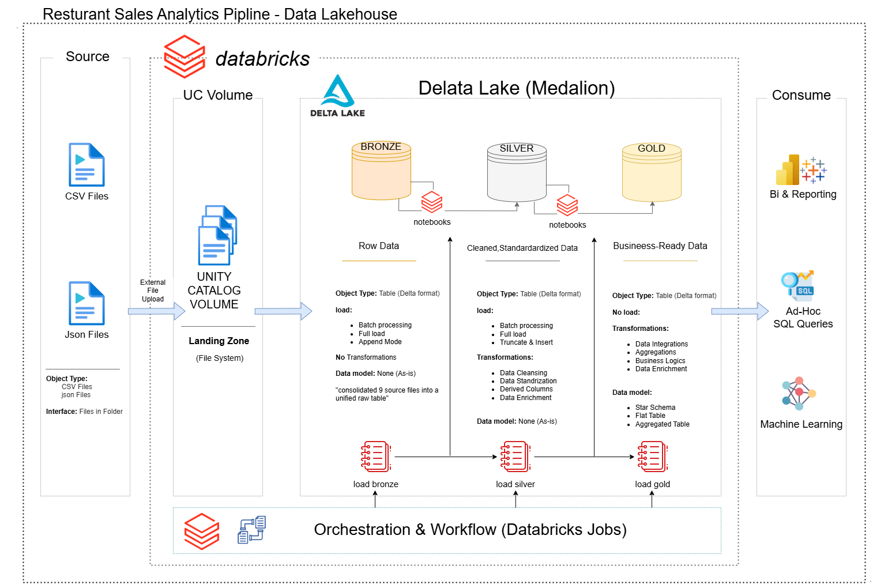
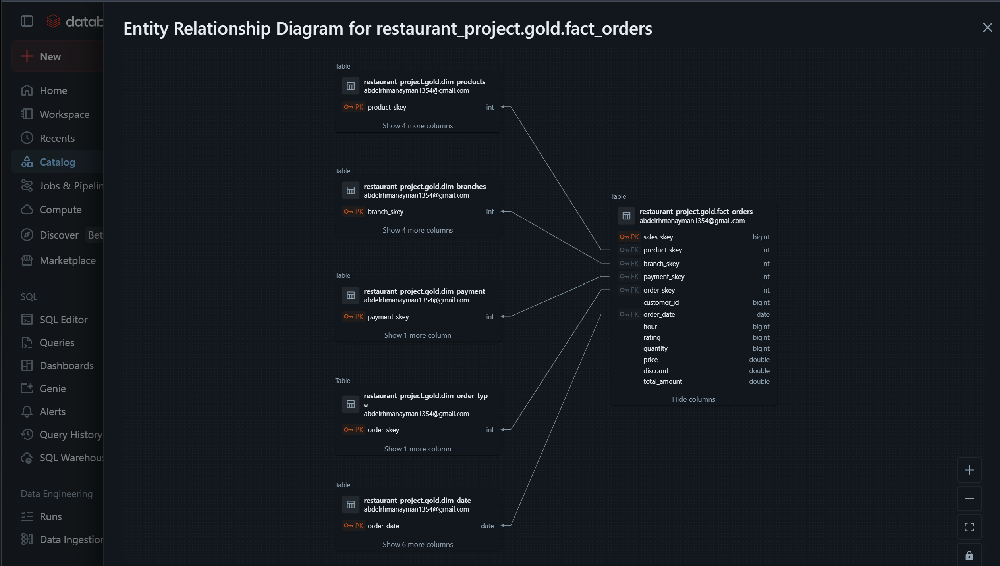

# 🍔 Al Cairo Kitchen: End-to-End Data Engineering & Analytics Project 

Welcome to the **Al Cairo Kitchen Analytics** repository! 
This project demonstrates a full-cycle Data Engineering and Business Intelligence solution. We transformed raw, fragmented restaurant data into a high-tech **Cyberpunk-style Dashboard** that provides deep strategic insights into sales, products, customers, and operations.

---

## 📖 Project Overview
This project implements the **Medallion Architecture** using modern data stack tools to handle high-volume restaurant transactions (11M+ orders).

1. **Data Engineering (Medallion Layers)**:
   - **Bronze**: Raw data ingestion from various sources.
   - **Silver**: Data cleaning, handling missing values, and standardizing schemas.
   - **Gold**: Business-ready Star Schema with Facts and Dimensions.
2. **Data Modeling**: Optimized Star Schema for sub-second analytical queries.
3. **Advanced Analytics**: Implementing RFM-based customer segmentation and Time-Intelligence measures.
4. **BI Delivery**: A multi-page, interactive Power BI dashboard with a futuristic Cyberpunk UI.

---

## 🏗️ Data Architecture
The data follows a structured flow to ensure quality and scalability:

 

1.  **Bronze Layer**: Raw CSV files ingestion.
2.  **Silver Layer**: Cleaning, filtering, and schema enforcement.
3.  **Gold Layer**: Final analytical modeling (Star Schema).

---

## 🏛️ Data Modeling (Star Schema)
The project utilizes a centralized **Fact Table** surrounded by **6 Dimension Tables**, ensuring efficient data retrieval.



- **Fact Table**: `fact_orders` (Sales, Quantities, Ratings).
- **Dimension Tables**: `dim_products`, `dim_date`, `dim_customers`, `dim_branches`, `dim_payment`, and `dim_order_type`.

---

## 📊 Business Intelligence & Storytelling
The final output is a comprehensive 6-page Power BI dashboard designed to tell a story about the business's health and growth potential.


### 🔍 Strategic Insights:
*   **Performance Scale**: 2.90 Billion in Revenue with 11 Million Orders.
*   **Customer Risk**: Identified that ~45% of the customer base is in the "At Risk" or "Slipping" category.
*   **Peak Operations**: Sunday at 8:00 PM is the critical peak for the kitchen.
*   **Menu Optimization**: Identified "Kebab" as the primary revenue driver, while spotting gaps between high-volume and high-rated items.

---

## 🛠️ Tools & Technologies
- **Language**: Python (Pandas, PySpark)
- **Data Processing**: Databricks / Jupyter Notebooks
- **Database**: Delta Lake (Medallion Architecture)
- **BI Tool**: Power BI (DAX, Power Query)
- **Design**: Figma (Custom UI/UX Backgrounds)
- **Version Control**: Git & GitHub

---

## 📂 Repository Structure
```text
Al-Cairo-Kitchen-Project/
│
├── dashboard/                   # Power BI files & Visual assets
│   ├── photo/                   # Dashboard screenshots for documentation
│   └── README.md                # Detailed dashboard storytelling & insights
│
├── Data Validation/             # Notebooks for Quality Assurance
│   ├── quality_checks_silver.ipynb
│   └── quality_checks_gold.ipynb
│
├── docs/                        # Project documentation & Architecture
│   ├── Architecture.png         # Architecture diagram
│   ├── Model.png                # Data Model (ERD) diagram
│   ├── data_catalog.md          # Full metadata & field descriptions
│   └── orchestration.png        # Workflow orchestration details
│
├── scripts/                     # ETL Pipeline Notebooks
│   ├── bronze/                  # Raw data ingestion scripts
│   ├── silver/                  # Data cleaning & transformation
│   ├── gold/                    # Star Schema & Dimension modeling
│   └── schema_constraints/      # Schema enforcement scripts
│
├── README.md                    # Main Project Documentation
├── LICENSE                      # MIT License
└── requirements.txt             # Python dependencies
