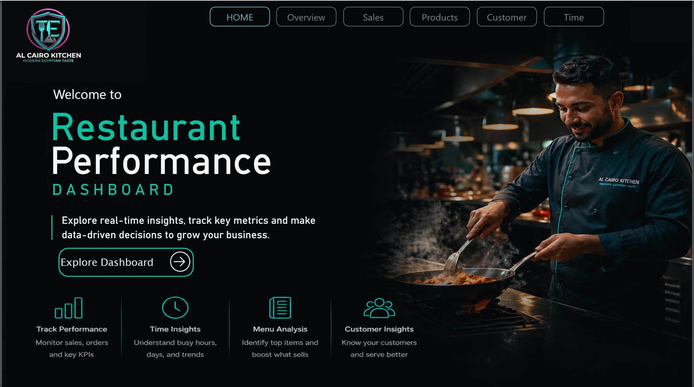
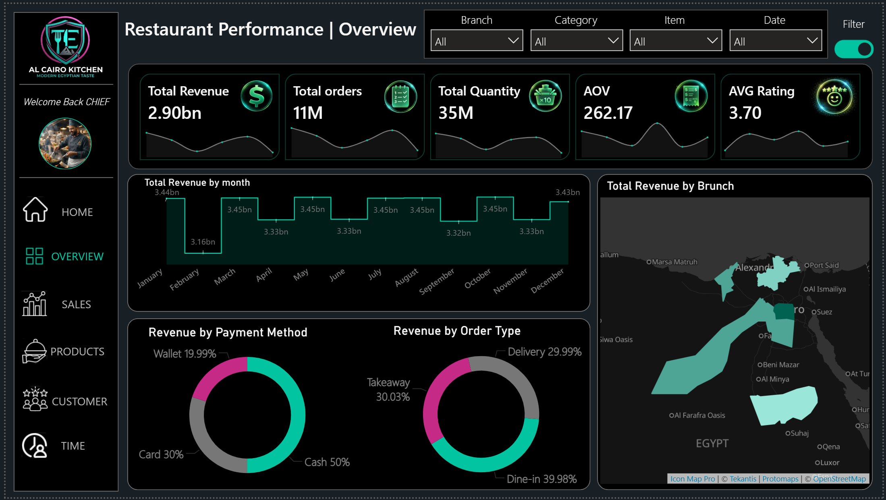
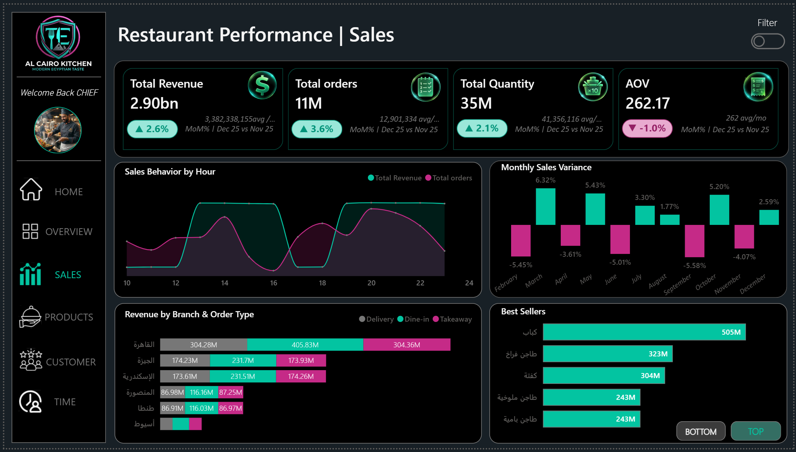
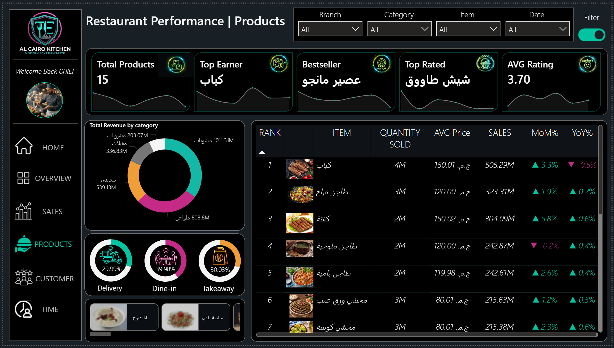
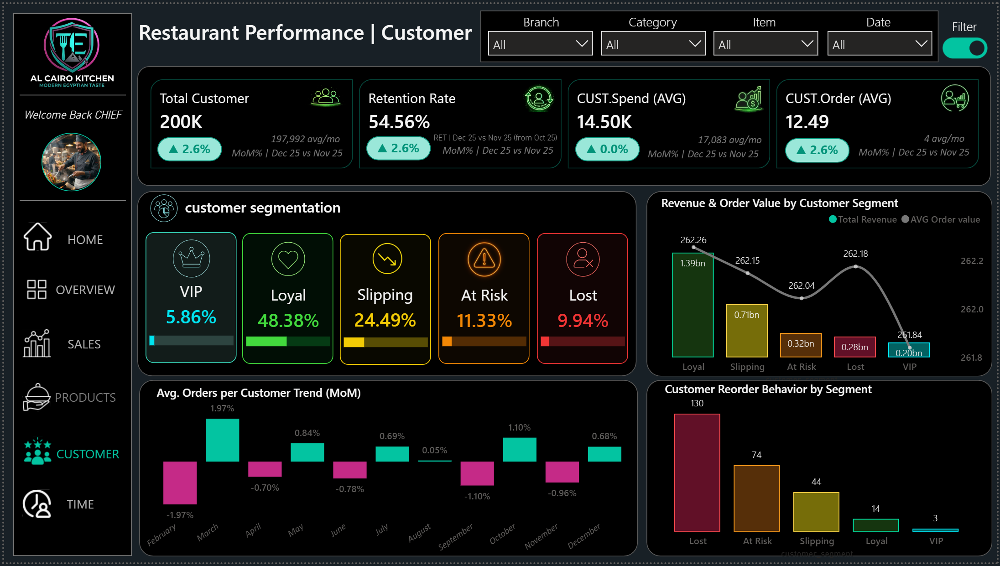
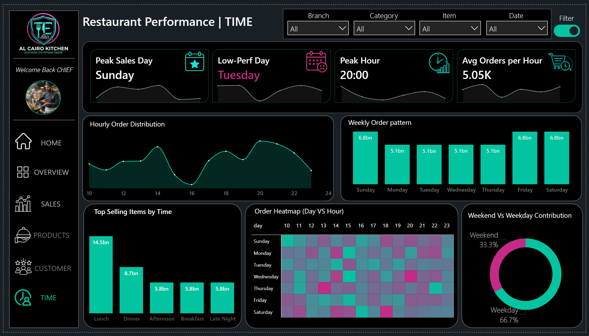

# 📊 Restaurant Performance Analytics: A Data Storytelling Journey

Welcome to the **Al Cairo Kitchen** analytical suite. This dashboard isn't just about charts; it's a strategic tool designed to navigate the complex operations of a modern restaurant through data-driven decisions.

---

## 🏠 1. The Gateway: Home Page
Everything starts here. Our Home Page is designed as an executive landing zone, welcoming the "Chief" to their data empire. It provides a clear entry point to all analytical modules, setting the tone with a sleek, high-tech Cyberpunk aesthetic.

> **Key Focus:** Quick navigation and brand identity. It’s the "Control Center" for exploring real-time insights across Sales, Products, Customers, and Time.

---

## 🌐 2. The Big Picture: Overview
Before diving into details, we look at the high-level health of the business. The Overview page answers the most critical question: *"How are we doing overall?"*

*   **Financial Pulse:** Tracking **2.90bn in Revenue** with over **11M Orders**.
*   **Geospatial Insights:** A custom map of Egypt shows exactly which branches are the "Power Houses" (like Cairo and Alexandria).
*   **Operational Mix:** We can see that **Cash** is still king (50%), and **Dine-in** represents the core of our service (40%).

---

## 📈 3. Revenue Dynamics: Sales Analysis
Now we dig into the "Flow" of money. This page tracks growth, variance, and the behavior of our revenue streams.

*   **Growth Tracking:** We monitor **MoM% (Month-over-Month)** to see if our 2.6% revenue growth is consistent.
*   **The "Why" Behind the Numbers:** The **Monthly Sales Variance** chart helps us identify which months were "disruptors" (positive or negative).
*   **Best Sellers:** A quick toggle lets us see our "Stars" (Top items like Kebab) versus our "Underperformers" (Bottom items).

---

## 🍔 4. Menu Intelligence: Product Analysis
Not all items are created equal. This page is dedicated to optimizing the menu and understanding what people crave.

*   **The Profit Leaders:** We identify the **Top Earner** (Kebab) and the **Bestseller** (Mango Juice).
*   **Category Dominance:** A Donut chart breaks down revenue by category, showing how "Main Dishes" compare to "Appetizers".
*   **Performance Metrics:** Every item is ranked by Sales, Quantity, and **MoM% Growth**, allowing the kitchen to prepare for upcoming demand.

---

## 👥 5. The Human Element: Customer Insights
A restaurant is nothing without its people. This page uses **Customer Segmentation** to turn anonymous diners into loyal fans.

*   **Segmentation (Loyalty Ladder):** We categorize customers into **VIP, Loyal, Slipping, At Risk,** and **Lost**. 
*   **Retention Focus:** With a **54.56% Retention Rate**, we can see that our "Loyal" segment (48.38%) is the backbone of the business.
*   **Reorder Behavior:** We analyze the "Gap" between orders to trigger marketing campaigns for "At Risk" customers before they drift away.

---

## ⏱️ 6. The Heartbeat: Time Analysis
Efficiency is found in the seconds. This page analyzes the "When" to optimize staffing and preparation.

*   **The Peak Pulse:** We identified **Sunday** as the Peak Sales Day and **20:00 (8 PM)** as the Peak Hour.
*   **Operational Density:** Our **Order Heatmap** reveals the "Golden Hours" versus the "Dead Zones," helping management reduce labor costs during low-perf days like Tuesday.
*   **Weekday vs. Weekend:** Surprisingly, **66.7%** of our contribution comes from Weekdays, challenging the traditional "Weekend-only" growth myth.

---

## 🛠️ Technical Implementation
*   **Tools:** Power BI, DAX (Dynamic Measures), Figma (UI Design).
*   **Data Architecture:** Star Schema (Gold Layer) ensuring sub-second report responsiveness.
*   **Logic:** Integrated RFM analysis for customer segmentation and advanced Time-Intelligence for growth tracking.

---
**Explore the data. Rule the kitchen. Grow the business.**
